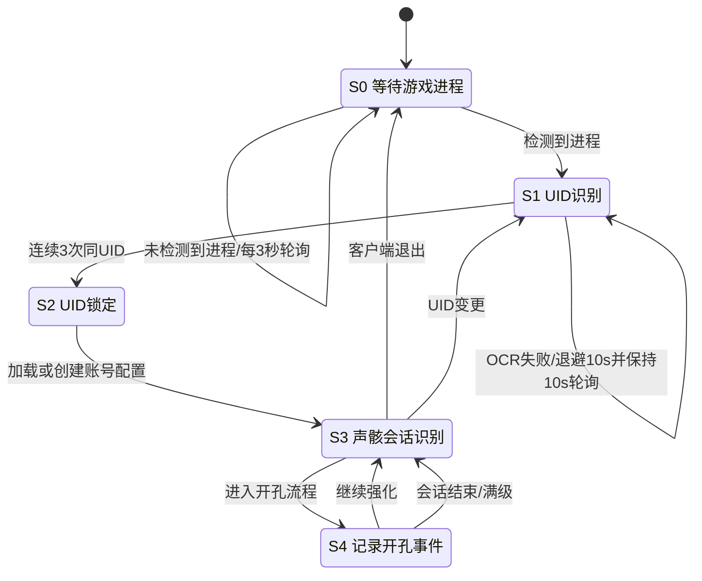

# mc_sys 重构架构设计（草案）

## 1. 目标

本次重构目标是把当前“识别样本记录”升级为“可追溯的强化决策数据系统”，满足：

- 自动识别游戏进程与UID，支持账号自动切换。
- 跟踪单只声骸从初始到满级的强化会话。
- 完整记录开孔动作（单开/多开）和开孔事件（孔位结果）。
- 支持历史未知副词条补录，避免与实时观测混淆。
- 产出可用于条件概率分析和策略推荐的数据。

## 2. 现有模块与重构后职责

- `src/capture.py`
  - 现有：窗口捕获，支持WGC与回退方案。
  - 重构后：向主流程提供稳定帧流与捕获状态（后端、FPS、错误码）。

- `src/ocr.py`
  - 现有：OCR文本返回。
  - 重构后：返回统一结构 `text/confidence/region/source`，支持投票与阈值过滤。

- `src/pipeline.py`
  - 职责：统一编排状态机、UID锁定、会话识别、开孔事件入库、概率分析。

- `src/db.py`
  - 职责：账号、声骸信息、开孔事件、登录记录、副词条配置。

- `src/probability.py`
  - 现有：全局频率/贝叶斯。
  - 重构后：基于开孔前条件状态的分层概率与动作建议（单开/多开）。

## 3. 主流程逻辑

### 3.1 启动与UID锁定

1. 启动后检测游戏进程。未启动时每3秒轮询。
2. 进程存在后开始识别右下角UID。
3. 未识别到UID时按 3 秒、5 秒、10 秒退避；达到10秒后固定10秒轮询。
4. 连续3次识别到同一UID，判定锁定成功。
5. 加载该UID对应账号配置；不存在则创建账号记录。

### 3.2 声骸会话归并

声骸会话以“同一声骸唯一ID”为主。若唯一ID不可得，则临时采用：

- 主词条相同
- 套装相同
- 等级连续递增

满足上述条件则归并同会话；否则创建新会话。

### 3.3 开孔事件

- 事件（Event）表示单个孔位结果。
- 单开/多开信息直接记录在事件表字段中，不再单独维护 `enhance_actions` 表。
- 一次多开产生多条事件，并共享同一个 `action_id` 分组值。

## 4. 等级与槽位显示/校验规则（最终口径）

### 4.1 可开孔等级

可开孔阈值固定为：`5 / 10 / 15 / 20 / 25`。

### 4.2 未达等级显示

若尚未达到下一阈值，显示：`强化至+X可调谐`。

### 4.3 达到等级后的显示

- 强化界面：未激活槽显示 `待调谐`。
- 强化界面中当前目标槽显示 `激活新辅音属性`。
- 已激活槽：显示 `属性 + 数值`。

### 4.4 多槽并存

当存在多个可开未开槽时：

- 当前目标槽显示 `激活新辅音属性`。
- 其他已达等级但未操作槽显示 `待调谐`。

## 5. 数据模型（已在 `src/db.py` 实现）

所有时间字段统一写入本机本地时间，不使用 UTC。

### 5.1 账号表 `accounts`

- `id`：主键
- `uid`：游戏UID（唯一）
- `name`：本机名称
- `created_at`：账号创建时间
- `account_hash`：由 `id + uid + name + created_at` 生成的16位hash
- `total_enhance`：账号累计强化次数
- `today_enhance`：今日强化次数，游戏日按凌晨4点切换
- `client_enhance`：当前游戏客户端强化次数，客户端PID变化后重置为0
- `last_client_start_at/last_client_pid`：最近一次游戏客户端启动信息

### 5.2 声骸信息表 `echo_info`

- `account_id`：外键，与 `echo_instance_id` 组成主键
- `uid`：游戏UID冗余字段
- `echo_instance_id`：由声骸名、套装、主属性、已有辅音顺序生成的实例ID
- `echo_name/cost/set_name/main_stat`
- `initial_substat_count`：首次生成实例ID时已有辅音数量
- `created_at`

空白辅音声骸不生成 `echo_instance_id`；当第一个辅音出现后才写入 `echo_info`。后续新增辅音继续沿用 active context 首次绑定的实例ID。

约束：

- `cost in (1,3,4)`
- `initial_substat_count in [1,5]`

### 5.3 声骸辅音表 `echo_substats`

- `id`：本地自增ID，用于上传数据库和断点续传
- `event_id`：UUID
- `session_id/action_id/account_id`：`session_id` 沿用旧列名，指向 `echo_info.echo_instance_id`
- `action_id`：同一次开孔动作的分组ID，不再外键到动作表
- `action_type`：`single|multi|unknown|history`
- `action_open_count`：本动作新增孔数（1~5）
- `action_start_level/action_end_level`
- `action_span_holes`：例如 `2,3`
- `slot_index`：第1~5孔
- `level_before`：5/10/15/20/25
- `substat_name/substat_value/value_tier`
- `is_historical_unknown`
- 统计字段：`game_day_index/is_first_enhance_of_day/is_just_logged_in/is_just_client_restarted/restart_open_index/day_enhance_count`
- 质量字段：`ocr_confidence/source_region`

### 5.4 登录记录表 `login_records`

- `login_id`：UUID
- `account_id`
- `login_at`
- `is_client_restart`

## 6. 历史未知副词条补录

当程序启动后首次观察到“非+0且已有副词条”的声骸：

- 新建声骸信息（如不存在）。
- 对可见副词条创建事件，写入 `action_type=history` 并标记 `is_historical_unknown=true`。后续统计字段如 `is_first_enhance_of_day` 等对 `history` 记录无需填写。

## 7. 会话识别状态机（Mermaid）

## 8. 统计与概率建模建议

### 8.1 最小条件变量

- 会话侧：`cost/set_name/main_stat/initial_substat_count`
- 事件侧：`slot_index/level_before/existing_substats`
- 开孔侧：`action_type/action_open_count`

### 8.2 样本质量控制

- `is_historical_unknown=true` 的事件默认降权或单独分桶。
- `ocr_confidence` 低于阈值可进入待审核池，不直接入训练集。

### 8.3 推荐输出

- 当前条件下各候选副词条概率。
- 单开与多开的期望收益差。
- 成本分析：已开孔数、有效命中数、1/2档核心命中数和剩余孔位。
- 边际成本：按第1~5孔递增的相对强化成本估算下一孔投入，结合下一孔有效概率决定是否继续。
- 及时抽离：前2孔均未命中有效词条时直接放弃；前3孔未命中1/2档核心词条，或投入4孔仍缺核心命中时，建议停止强化并换声骸；连续低效时可提示重启客户端后再继续。
- 好胚子暂存：如果前两孔已命中核心词条但下一孔有效概率偏低，建议先换另一个声骸强化；当下一孔有效概率回升时建议回到该声骸继续。
- 满词条策略：已开满5个辅音后不再运行剩余词条的大数据推断，只做最终词条评估。
- 风险提示（样本不足、历史未知比例过高、识别置信度偏低）。

## 9. 实施顺序

### P0（优先）

1. 在主流程接入UID锁定状态机。
2. 写入会话、动作、事件、登录记录。
3. 建立历史未知补录流程。

### P1

1. OCR投票/阈值/错误恢复。
2. 游戏日切线统计与计数器。
3. 概率模型从全局频率改为条件概率。

### P2

1. Alembic迁移脚本。
2. 数据回填与兼容脚本。
3. 可观测性（结构化日志、监控指标）。
